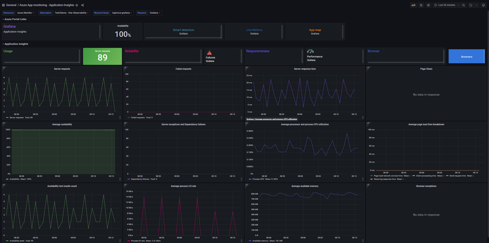

## Azure Application Insights
Application Insights is an Azure service that allows developers to monitor their applications in a centralized way, all the way from development through production. With the available data, software teams are able to proactively understand how their application is being used. In case of an incident, developers are able to reactively review metrics, logs and traces to find the root cause. 
![Azure Application Insights logo[small]](images/logo.png)

It is an essential tool to develop distributed applications and system at scale.

## OpenTelemetry
When software teams or organizations manage multiple applications, it might be useful to collect all this data in a single place. Only by doing so we're able to see the entire picture of what's happening across all these systems.
Doing so requires that logs, traces and metrics are generated in a standardized data format.

![OpenTelemetry Logo [medium]](images/opentelemetry.png)

This is where [OpenTelemetry](https://opentelemetry.io/) comes in. By standardizing the format in which data is collected, software teams can start using different products together without being vendor dependant. 

## Getting started

### Create an Application Insights instance
Go to the [Azure Portal](https://www.portal.azure.com) and create a new Application Insights resource.


After creating the instance, we can go to the Overview tab and copy the connection string


This connection string is always needed to connect to our instance of Application Insights.

> On March 31, 2025, support for instrumentation key ingestion will end. Instrumentation key ingestion will continue to work, but Microsoft will no longer provide updates or support for the feature. Connection strings will be the preferred way of connecting from now on.


### Auto instrumentation (agents)
Auto instrumentation is the easiest way to start collecting data, without even having to make code changes.
Various target environments, such as Azure Functions and Azure App Service even enable Azure Insights logging by default!

See the [app insights overview](https://learn.microsoft.com/en-us/azure/azure-monitor/app/app-insights-overview?tabs=net#how-do-i-instrument-an-application) for an overview of the multiple auto-instrumentation possibilities for different languages.

## Logging in DotNET
If you're writing dotnet code, changes are high you're using a logging library.
Most commonly used logging libraries provide a way to determine multiple targets for you logging data.
E.g. you might want to log to both a file on disk and to Azure Insights.

### Log4net
[Log4net](https://logging.apache.org/log4net/) has a logging appender which is available through a [NuGet package](https://www.nuget.org/packages/Microsoft.ApplicationInsights.Log4NetAppender/2.21.0).

After adding the package to the dotnet application, we can update the log4net config file to include the new appender. 
```xml
<log4net>
    <root>
        <level value="ALL"/>
        <appender-ref ref="aiAppender"/>
    </root>
    <appender name="aiAppender" type="Microsoft.ApplicationInsights.Log4NetAppender.ApplicationInsightsAppender, Microsoft.ApplicationInsights.Log4NetAppender">
        <layout type="log4net.Layout.PatternLayout">
        <conversionPattern value="%message%newline"/>
        </layout>
    </appender>
</log4net> 
```
### Serilog

[Serilog](https://serilog.net/) has a [logging sink](https://www.nuget.org/packages/Serilog.Sinks.ApplicationInsights/) to send the collected logs to Application Insights.

The sink can be configured in code in the following way:

```csharp
var log = new LoggerConfiguration()
    .WriteTo.ApplicationInsights(TelemetryConfiguration.Active, TelemetryConverter.Traces)
    .CreateLogger();
```

### Nlog
[Nlog](https://nlog-project.org/) has a [logging target package](https://www.nuget.org/packages/Microsoft.ApplicationInsights.NLogTarget/2.21.0) which can be used to direct the logs to Application Insights.

The following configuration can be used to set up the logging target with the correct instrumentation key or connection string:
```xml
<nlog xmlns="http://www.nlog-project.org/schemas/NLog.xsd" xmlns:xsi="http://www.w3.org/2001/XMLSchema-instance">
    <extensions>
        <add assembly="Microsoft.ApplicationInsights.NLogTarget" />
    </extensions>
    <targets>
        <target xsi:type="ApplicationInsightsTarget" name="aiTarget">
            <instrumentationKey>Your_Resource_Key</instrumentationKey>	<!-- Only required if not using ApplicationInsights.config -->
            <contextproperty name="threadid" layout="${threadid}" />	<!-- Can be repeated with more context -->
        </target>
    </targets>
    <rules>
        <logger name="*" minlevel="Trace" writeTo="aiTarget" />
    </rules>
</nlog>
```

## Manual data collection
Besides using a logging target, we can also 'manually' create a metric, trace or log.
Microsoft provides [a SDK](https://www.nuget.org/packages/Microsoft.ApplicationInsights) through a Nuget package to easily interact with your instance.
In dotnet we can do this in the following way:
```csharp
using Microsoft.ApplicationInsights;

public void CreateLog(string message,SeverityLevel level, IDictionary<string, string> props)
{
    // Set up the telemetry client - You could cache this / make it static
    TelemetryConfiguration configuration = TelemetryConfiguration.CreateDefault();
    configuration.ConnectionString = "my-connection-string";
    var client = new TelemetryClient(configuration);

    // Create a trace
    client.TrackTrace(message,level, props);
}
```

The TrackTrace method accepts 3 arguments:
- Message : The string you want to log
- Level : The level you want to log. Can be Verbose | Information | Warning | Error | Critical
- Props: An object that implements IDictionary that can hold multiple key-value pairs.

The dictionary could for example contain the following information:

```csharp
properties = new Dictionary<string, string>();
properties.add("user-id", 10);
properties.add("api-endpoint,"/api/v2/users");
```

This way we can add our own custom data fields to the log traces.

## Inspecting the data

We can verify that our data collection is working by going to the Azure Portal and visiting our instance.
We can view the logs under *Monitoring > Logs*.
The portal allows us to query our data using [KQL, the Kusto Query Language](https://learn.microsoft.com/en-us/azure/data-explorer/kusto/query/).

![Inspecting the collected logs using the Azure Portal [medium]](images/portal3.png)


If we would like to inspect the last 100 traces we generated using the above dotnet code, we could perform the following query:
```kql
traces
| take 100
```

Please make note of the | (pipe) symbol used in KQL. 
If we would like to see which log lines contain a certain string, we could do this by adding a where clause:

```kql
traces
| where message has "jef"
| take 100
```

Query data in the customDimensions field using the following syntax:

```kql
traces
| where customDimensions["user-id"] = 10 
| take 100
```

## Visualising data using dashboards

While it is beyond the scope of this article, you can visualize the collected data by using dashboards.

### Azure Dashboard
Azure offers a dashboard service on its own.
This service can also be created through the Azure Portal.


### 3rd party dashboards

But because we collected our data in a vendor independent format, we can integrate Application Insights with many 3rd party dashboard tools, such as [Grafana](https://grafana.com/)



## Summary
Application Insights provides various ways to integrate data logging in our existing or new applications.
This can be done both by making configuration changes (auto-instrumentation) or by making minor code changes. 
It allows us to collect metrics, logs and traces in a standard data format, made possible by OpenTelemetry.
This open data format prevents vendor lock-in, and allows us to integrate our data with many 3rd party tools and systems.


Do let me know if you spot any mistakes or inaccuracies.
All feedback is welcome!
Jef

## Further reading
- https://learn.microsoft.com/en-us/azure/azure-monitor/app/ilogger
- https://stackoverflow.com/questions/28800320/log4net-with-application-insights
- https://github.com/serilog-contrib/serilog-sinks-applicationinsights
- https://www.nexsoftsys.com/articles/integrating-apps-insights-with-nlog-aspnet-core.html
- https://www.nuget.org/packages/Microsoft.ApplicationInsights.NLogTarget
- https://learn.microsoft.com/en-us/azure/data-explorer/kusto/query/


