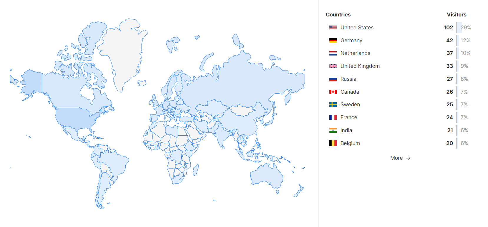

## Introduction
I used to store my page visits for this blog in a simple postgress database, hosted on [Supabase](https://supabase.com/).
Every time the server had to serve a page to a client, it also added an entry to the database. 
While it did work for basic usage, I wanted to gain a bit more insights in page visits.

I was looking for something with the feature set of Google Analytics, but without giving up my visitors privacy.  
That's when I found out about [Umami](https://umami.is/), a self-hosted Google Analytics alternative!


## What is Umami?
According to their own [Github Repository](https://github.com/umami-software/umami), *Umami is a simple, fast, privacy-focused alternative to Google Analytics*.
It is a data collection platform with a dashboard that you can integrate with any kind of website. 
It tracks your user visits, how much time they spend on your site, which country they come from, etc.. .

Besides these great features, it is also open source, which means you're able to easily self-host.
These features make it a really great solution to gather website analytics for free, with the privacy of your users in mind. 


## A few features
Below are a few great features from Umami. 
Besides basic user visit logging, there are also other things such as:
#### Viewing geolocation data

#### Inspecting individual user sessions


Umami also allows things such as custom event tracking (e.g. which buttons are pressed), realtime sessions, comparisons between two periods, report generation, ...
Another great feature for me is that, when self-hosting, you can supply your own Postgress or MySQL database.
This allows for easy integration with custom written software!

All of this is included in a really fluent and responsive interface. 
Bonus point for the neat design of the platform!

## Hosting
### Self-hosting
Umami is released as a Docker image, so for the version with Postgres support you can simply pull the following container:

```cmd
docker pull docker.umami.is/umami-software/umami:postgresql-latest
```

### Cloud hosting
Umami also offers hosting via [Umami Cloud](https://umami.is/pricing), with a free hobby plan going up to 100K events each month for a maximum of 3 websites.
Anything more puts you in the $20 per month *Pro* category

## Getting Started with Umami
To get started we need to do 4 things:
1. **Install the application** (self hosted or cloud) and preferably assign a domain or subdomain 
2. Log in with the default credentials (admin/umami) and **change your password**
3. Go to settings and **Add a website**
4. **Copy the tracking script** and add it to the HTML code of your website

Now you're ready to start collecting user visit data!

## Conclusion
All in all, Umami is a great web analytics solution, especially with it being open source!
I assume that, from now on, all projects I create will use Umami for visitor analytics!

## Further reading and relevant links
- https://umami.is/
- https://x.com/umami_software
- https://github.com/umami-software/umami

