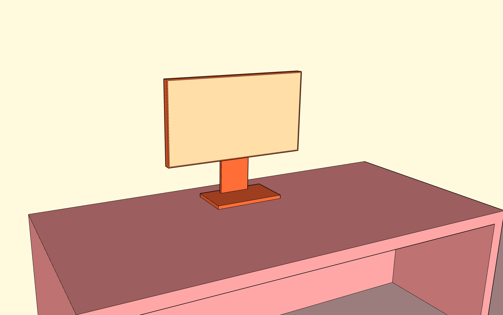
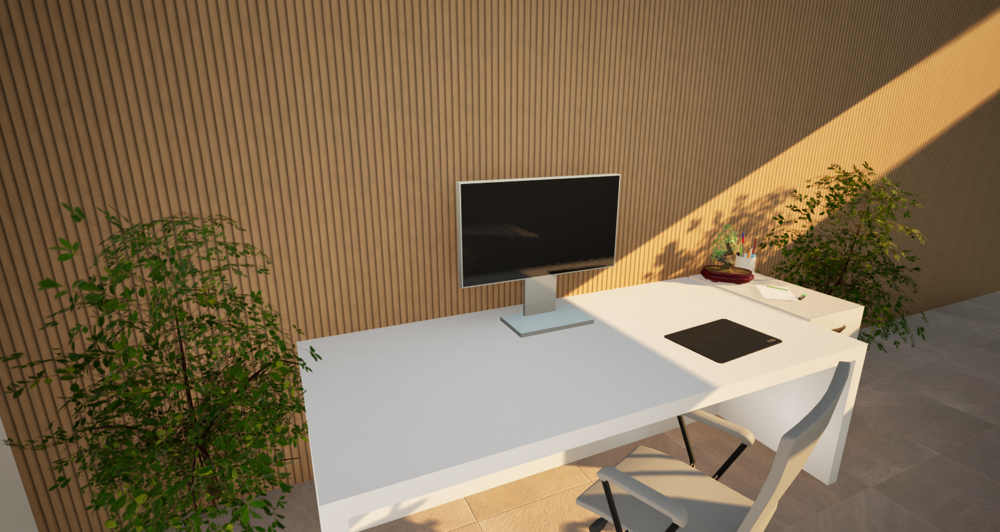
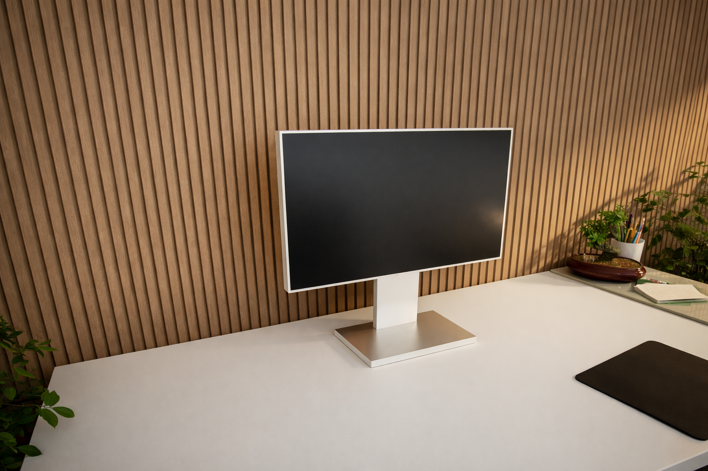

# Creating a realistic render
Let's try to create a realistic render result by chaining a few tools together!
## 1. Sketchup
Start out by using Sketchup, or any similar modeling tool to create a low fidelity version of the scene you're trying to create.

![Sketchup logo [medium]](images/sketchup-logo.jpg)

For this example lets go with a simple desk with a monitor on it. 
The scene consists just out of a couple of boxes added together. 
All the materials have a different color, and at this stage nothing has a real texture yet.

At the end we save the scene as a .skp file. 

## Twinmotion
For the rendering part we swith over to Twinmotion.
![Twinmotion logo [medium]](images/twinmotion-logo.png)
Import the scene in Twinmotion and start assigning materials to every surface.
Some models are also imported to add some more details, such as a few plants and an office chair.

To export the image we render it using the path tracer at a 4k resolution.

## ChatGPT
For the final, and optional step we're going to combine the output of the previous step with a simple ChatGPT prompt.
In this particular case the prompt was "Make this render look like a realistic picture". 
The result can be seen below.

And that's it! 
By combining a couple of blocks stacked together, together with some included twinmotion models, we're able to generate a realistic looking scene!

## Read More

- [sketchup.trimble.com](https://sketchup.trimble.com/)
- [www.twinmotion.com](https://www.twinmotion.com/)

